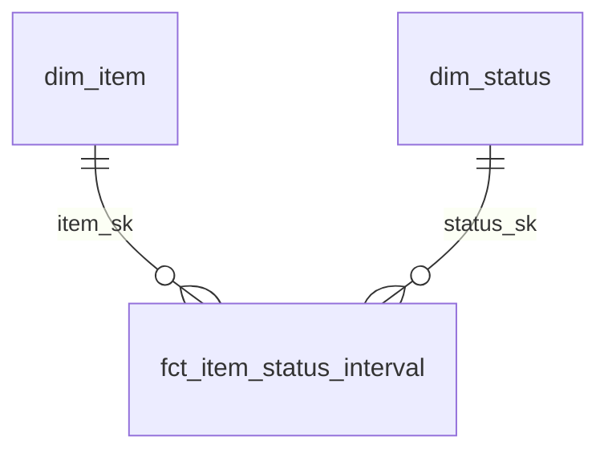

# Como relacionar as tabelas e construir indicadores

Guia prático, 11/09/2026. Leia junto do [dicionário das 16 tabelas e quatro views](PRD_ANALITICO.md). O objetivo desta fase é conhecer os tempos reais e encontrar padrões, sem metas de prazo predefinidas.

## Por que existem camadas

| Camada | Pergunta que responde | Objetos do projeto |
|---|---|---|
| Bronze — recebido da origem | O que a API retornou e quando observamos? | Logs de status, snapshots de itens e schema do quadro; JSON original preservado |
| Prata / Silver — organizado | Qual projeto mudou de qual status para qual status, em que instante? | `silver_monday_status_event_stg` |
| Ouro / Gold — pronto para analisar | Quanto durou cada visita e cada etapa? | Tabelas `fct_*` e views `gold_*` |
| Cadastros compartilhados | Quem é o projeto, o status, a pessoa e o quadro? | Tabelas `dim_*`, ponte de pessoas e catálogo de colunas |
| Controle | A carga está atualizada e o histórico é confiável? | Watermark, execuções e diagnósticos |

Exemplo ilustrativo: a Bronze guarda o JSON de uma mudança para Orçamento às 10h e outra para Revisão às 14h. A Prata normaliza esses eventos. A Ouro transforma a sequência em uma visita a Orçamento de quatro horas. As camadas permitem corrigir o cálculo e reconstruir resultados com a evidência preservada. Você normalmente analisa a Ouro com os cadastros; consulta Bronze/Prata para auditoria.

As camadas estão no mesmo schema PostgreSQL, identificadas pelos nomes das tabelas. Não são três bancos e não exigem que o usuário faça joins entre todas elas para obter um indicador.

## Relacionamento não é correlação estatística

Aqui, relacionar significa juntar tabelas pela identidade correta. Isso permite comparar duração por Marca, projeto ou etapa. Uma associação entre Marca e duração não demonstra que a Marca causou a demora: volume, tipo de projeto, complexidade e qualidade histórica também influenciam.

## Comece com três tabelas



| Ligação | Cardinalidade | Para que usar |
|---|---|---|
| `dim_item.item_sk` → `fct_item_status_interval.item_sk` | Um projeto para várias visitas (1:N) | Filtrar todas as passagens do projeto escolhido |
| `dim_status.status_sk` → `fct_item_status_interval.status_sk` | Uma etapa para várias visitas (1:N) | Mostrar nome da etapa e comparar durações |
| `dim_item.item_sk` → `fct_item_status_daily.item_sk` | Um projeto para várias linhas diárias | Distribuir a permanência por dia |
| `dim_status.status_sk` → `fct_item_status_daily.status_sk` | Uma etapa para várias linhas diárias | Filtrar os minutos diários da etapa |
| `dim_item.item_sk` → `fct_item_sla_summary.item_sk` | Um projeto para no máximo um resumo (1:0..1) | Consultar estado atual e lead time |
| `dim_person.person_sk` → `bridge_item_person.person_sk` | Uma pessoa para várias atribuições | Saber em quais projetos e papéis ela foi observada |
| `dim_item.item_sk` → `bridge_item_person.item_sk` | Um projeto para várias atribuições | Identificar as pessoas relacionadas ao projeto |

No SQL, `item_id` e `status_id` também são chaves válidas preservadas no modelo; as SKs oferecem a identidade técnica comum. No Power BI, escolha uma chave por relacionamento; não ative simultaneamente relacionamentos equivalentes por ID e SK. Não relacione pelo nome do projeto ou rótulo do status.

## Consulta básica: projeto + status + horas

```sql
SELECT p.item_id, p.item_name AS projeto,
       s.status_label AS etapa,
       count(*) AS visitas,
       sum(f.duration_hours) AS horas_acumuladas
FROM rede_globo.fct_item_status_interval f
JOIN rede_globo.dim_item p ON p.item_sk = f.item_sk
JOIN rede_globo.dim_status s ON s.status_sk = f.status_sk
WHERE f.board_id = 18429499488
  AND f.item_id = :item_id
GROUP BY p.item_id, p.item_name, s.status_id, s.status_label
ORDER BY horas_acumuladas DESC;
```

Essa versão básica soma todos os trechos, inclusive estimativas e a visita aberta. Para separar as qualidades, use a consulta 3 em [006_analise_projeto.sql](../sql/006_analise_projeto.sql). Para comparar duração final das etapas, use a consulta 6, com população elegível definida.

O total não precisa ser igual ao lead time: permanência pode incluir trecho anterior à Entrada comprovada e tempo em status final. A soma do fato de visitas mede o período reconstruído; o resumo aplica a regra de negócio desde Entrada.

## Montagem inicial no Power BI

Importe somente `dim_item`, `dim_status` e `fct_item_status_interval` para começar. Use as duas relações 1:N do diagrama, com filtro em uma direção: dimensão → fato. Um seletor com `dim_item.item_name` filtra as visitas; uma tabela/matriz com `dim_status.status_label` e soma de `duration_hours` apresenta as horas de cada etapa.

Inclua ID junto do nome para distinguir projetos homônimos. Acrescente `history_quality` como filtro/coluna e exiba o corte. Para a linha do tempo, use as linhas individuais do fato com início, fim/corte e indicador aberto. Não agrupe por etapa nessa visualização, pois isso esconderia retornos.

**Status histórico e status atual são papéis diferentes.** Não ative também `dim_status` → `dim_item.current_status_sk` no mesmo modelo inicial: isso cria outro caminho e pode restringir o passado ao status atual do projeto. Se precisar de um filtro independente de status atual, crie uma dimensão de papel separada, como `dim_status_atual`, ligada ao cadastro. Isso é uma configuração futura do modelo BI, não uma tabela já criada no banco.

Ao adicionar fatos diários, conecte-os às mesmas dimensões, sem relacionamento direto entre os dois fatos. Uma tabela calendário pode filtrar `fct_item_status_daily.dt`. Para visitas, defina se o período significa data de entrada, data de saída ou permanência dentro do período; são perguntas diferentes. Não somar horas dos fatos de visitas e diário entre si, pois representam o mesmo tempo em grãos diferentes.

O padrão dimensão/fato e os filtros seguem o modelo estrela: [orientação oficial Microsoft](https://learn.microsoft.com/en-us/power-bi/guidance/star-schema). Este guia não implica que um arquivo `.pbix` já tenha sido criado ou validado.

## Cruzar com outra base pelo ID do elemento

Se a nova base tiver exatamente uma linha por `board_id, item_id`, pode ser ligada ao cadastro. Se tiver várias linhas (por exemplo, vários orçamentos por projeto), agregue no grão desejado antes de cruzar medidas.

Exemplo **ilustrativo**, pois `nova_base_orcamentos` ainda não existe:

```sql
WITH valores AS (
    SELECT board_id, item_id, sum(valor) AS valor_total
    FROM nova_base_orcamentos
    GROUP BY board_id, item_id
), tempos AS (
    SELECT board_id, item_id, sum(duration_hours) AS horas_reconstruidas
    FROM rede_globo.fct_item_status_interval
    GROUP BY board_id, item_id
)
SELECT p.item_id, p.item_name, v.valor_total, t.horas_reconstruidas
FROM rede_globo.dim_item p
LEFT JOIN valores v USING (board_id, item_id)
LEFT JOIN tempos t USING (board_id, item_id)
WHERE p.board_id = 18429499488;
```

Se houver três orçamentos e cinco visitas, um join direto entre as duas bases geraria 15 linhas e poderia triplicar as horas. Duas agregações prévias preservam uma linha por projeto. Para métricas por etapa, conserve `status_id` no grão dos tempos e não some o valor do projeto repetido por etapa.

## Cruzar pessoas sem multiplicar as horas

Um projeto pode ter duas pessoas: juntar a visita às duas atribuições duplica a linha da visita. A chave da atribuição também inclui coluna/papel e data do snapshot. Para filtrar projetos/visitas de uma pessoa sem multiplicar as linhas, use `EXISTS`:

```sql
SELECT f.item_id, f.status_to, sum(f.duration_hours) AS horas
FROM rede_globo.fct_item_status_interval f
WHERE f.board_id = 18429499488
  AND EXISTS (
      SELECT 1 FROM rede_globo.bridge_item_person b
      WHERE b.board_id = f.board_id AND b.item_id = f.item_id
        AND b.snapshot_date = f.snapshot_date
        AND b.person_id = :person_id
  )
GROUP BY f.item_id, f.status_to;
```

A atribuição corresponde ao snapshot usado no enriquecimento, sujeito a `attribute_source`; não prova responsabilidade durante todo o intervalo. Projetos compartilhados podem aparecer para várias pessoas, então totais por pessoa não são aditivos. Dividir horas igualmente entre pessoas seria outra regra de negócio, que não foi implementada. Snapshot ausente pode impedir a correspondência.

## Marca, Talento e catálogo das colunas

`marca`, `talento`, `cliente` e `intervenciencia` estão materializados no fato de visitas e no fato diário, quando disponíveis na origem. Para comparar visitas por Marca, agrupe o fato por `marca` e `status_id`; evite juntar todos os snapshots do projeto ao fato.

`attribute_source=as_of_start` usa a última observação disponível até o início da visita. `earliest_available` usa a primeira observação disponível e é uma aproximação para atributos antigos. `unavailable` indica falta de versão. Não se deve interpretar esses atributos como histórico completo de mudanças antes da primeira coleta.

Para descobrir qual coluna Monday gerou cada atributo:

```sql
SELECT column_id, column_title, column_type, analytical_attribute,
       is_extracted, is_modeled, is_present
FROM rede_globo.meta_column_mapping
WHERE board_id = 18429499488
ORDER BY is_modeled DESC, column_title;
```

## Roteiro para cada indicador novo

1. Escreva a pergunta: tempo do projeto, duração final por visita, fila atual ou horas por dia.
2. Escolha o grão correspondente: projeto/status, visita, projeto atual ou projeto/status/dia.
3. Defina a evidência: observados, estimados separados, abertos e encerrados.
4. Escolha população e período. Exiba cobertura, nulos e tamanho da amostra.
5. Junte somente dimensões ou agregações com no máximo uma linha por chave de correspondência.
6. Confira um projeto individual e compare a soma antes/depois dos joins. As dimensões não devem multiplicar os minutos.

As oito consultas prontas foram executadas em leitura contra a VPS. Os exemplos de Power BI são instruções de modelagem; o exemplo de base futura exige que essa base exista antes de executar.
