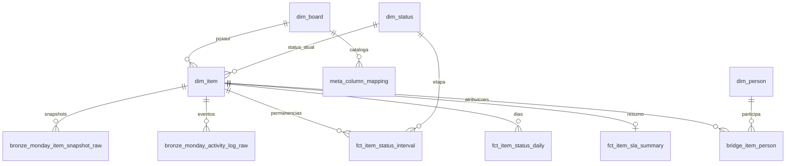

# Chaves e uso por outras análises

O elemento do Monday é `dim_item.item_id` (BIGINT); o valor é o ID original da API, não uma sequência interna. O quadro é `dim_board.board_id`. `event_id` preserva o ID de cada log.



As relações são impostas por FKs no PostgreSQL. O commit é único e as constraints são verificadas ao final; dados inválidos não são publicados. O mesmo contrato é declarado no BigQuery, onde precisa ser validado pela aplicação.

## Exemplo de futura base

```sql
-- Uma futura tabela deve declarar seu grão e conservar os IDs Monday.
-- Exemplo: sua_base tem um único registro por item e board.
SELECT i.item_id, i.board_id, i.item_name, s.status_atual,
       s.sla_start_utc, s.lead_time_total_min, outra.seu_indicador
FROM orcamento.dim_item i
LEFT JOIN orcamento.fct_item_sla_summary s USING(item_id, board_id)
LEFT JOIN sua_base outra USING(item_id, board_id);
```

Se `sua_base` tiver várias linhas por item, agregue antes do join ou preserve a granularidade conscientemente. Evite multiplicar valores por joins com a bridge de pessoas. Por snapshot, inclua `snapshot_date` no relacionamento.

## Catálogo de extração

```sql
SELECT board_id,column_id,column_title,column_type,analytical_attribute,
       is_extracted,is_modeled,is_present
FROM orcamento.meta_column_mapping
WHERE board_id=18429499488
ORDER BY is_modeled DESC,column_title;
```

`is_extracted=true` significa que a coluna é solicitada e preservada na Bronze (ou que o nome é extraído como campo do item). `is_modeled=true` significa que há atributo materializado. Colunas removidas do quadro permanecem no catálogo com `is_present=false`; a história do schema continua na Bronze.

## Chaves substitutas

`item_sk`, `board_sk`, `person_sk` e `status_sk` identificam entidades por UUIDv5 determinístico. As SKs das dimensões são UNIQUE e NOT NULL. Os IDs originais continuam como PKs/upsert nesta versão, e as tabelas de análise recebem ambas as chaves. FKs compostas conferem a correspondência entre ID e SK. Exemplo: `fct_item_status_interval.item_sk = dim_item.item_sk`.

O namespace/algoritmo está em `models/keys.py`; nunca o altere silenciosamente. A chave do item não depende de nome/board. Versões históricas SCD2 precisarão de outra chave (`item_version_sk`); snapshots já existentes não equivalem a um SCD2 completo. Veja o mapa de manutenção em [PRD.md](../PRD.md).

Para exemplos guiados de indicadores e modelo inicial de BI, leia [RELACIONAMENTOS_E_KPIS.md](RELACIONAMENTOS_E_KPIS.md).
